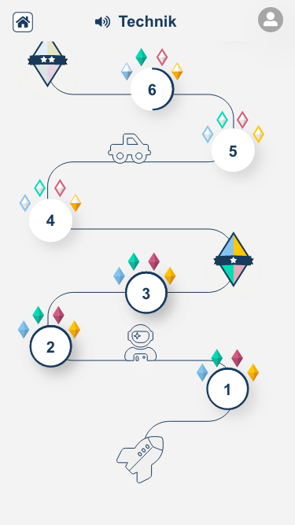

# Map Screen

The Map, in reality, consists of **two screens**:

- the map screen to select the level of difficulty (a station)
- the dimension screen to select the dimension and thus the resulting
  testCycle

## Map Screen

The map screen structures `TestCycles` along **Milestones** (large diamonds), each
prefixed by a sequence of **Stages** (numbered circles).




### Milestones

A milestone is a visual presentation of what is achievable within a certain 
level (not to be confused with alpha-level).

It is represented by a large diamond that contains up to four fields that are
coloured by the four dimensions and represents a `TestCycle` for the respective
dimension.


The color is by default grey-tinted until 80% of the`Competencies`, 
corresponding to this TestCycle, are fulfilled.

All UnitSets of a Milestone are sorted and equally distributed to a number of 
stages.


#### Algorithm

**1. Pre-conditions:** 
- none of the retrieved docs should contain a positve `isLegacy` flag!
- Get the current selected Field
- Get all Dimensions
- Get all Levels

**2. Sequence of retrieval:**

- Sort the Levels documents ascending by their numerical `level` property 
  (currently expected to be 1 .. 5)
- For each `level` in Levels and the current `field` do
  - get all TestCycle documents by `{ level, field }`
  - Assign each TestCycle to the linked dimension
  - If a dimension is not covered with a TestCyle, throw an Error
  - Throw an `Error` if there is more than one TestCycle per dimension 
  
Expected Result:

```javascript
{
  field: 'Technische Berufe'
  milestones: {
    'Level 1': {
      r: {
        name: 'Test_TB_RLevel 1',
        fulfilled: 0.10 // 10% -> grey-tinted
      },
      w: {
        name: 'Test_TB_MLevel 1',
        fulfilled: 0.85 // 85% -> colored
      },
      // ...
    },
    // ... other levels cut, since they have the same structure as shown above
  }
}
```


### Stages

A stage is a presentation of solve-able UnitSets, represented by a circle and an
ordered number, surrounded by a set of diamonds.


Stages are always prefixed to a **Milestone** and represent the same level (in 
fact they are linked by the Milestone's`TestCycle` lists). 
  
Each level has coloured diamonds attached, each representing progress of completed
competencies. The following rules apply:

- empty: no competency has been fulfilled 
- half full: when at least 10% of the competencies fulfilled
- full: at least 80% of the competencies are fulfilled


The circle is surrounded by a coloured border that represents the overall 
progress of the stage, independent from the degree of fulfillment of the 
competencies. 

#### Algorithm

**1. Pre-condition:**
- Milestones data is loaded and processed (see algorithm from **Milestones** 
  section)
  
**2. Sequence of retrieval:**

- For each `level` in `milestones` do
  - Create a variable `maxLen` with inital value of `0`
  - For each `dimension` in this `level` do
    - Fetch all UnitSets and store them in a ordered list
    - If the `length` of these UnitSets is greater `maxLen` then
    `maxLen` is set to `length`
  
Expected result (merged with the data from prior step):

```javascript
{
  'Level 1': {
    maxLen: 5,
    r: {
      unitSets: [{
        name: 'TB_2001',
        fulfilled: 0.65, // percent of fulfilled competencies
        completed: 0.50, // percent of completed tasks (pages)
      }, /* ... */]
    }
  },
  // ...
}
```
  
Transposing the data