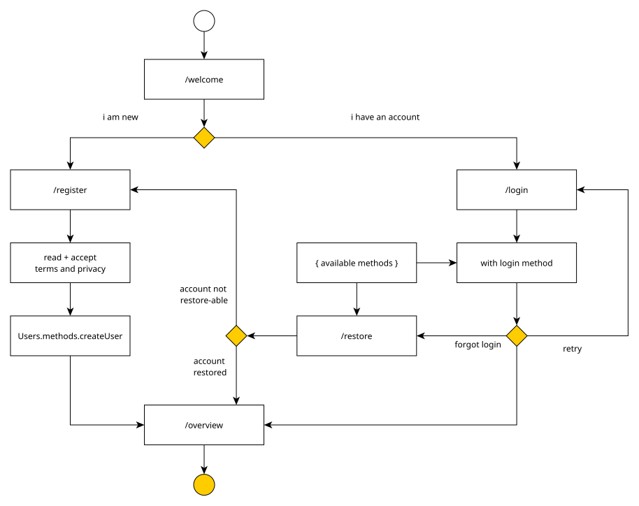

# Authentication Workflow

This folder and all included subfolders represent the pages, involved in the authentication workflow:

- welcome - starting point for the auth workflow
- register - registration of new accounts
- login - authenticate using an existing supported method
- restore - restore an existing account using an existing supported method

